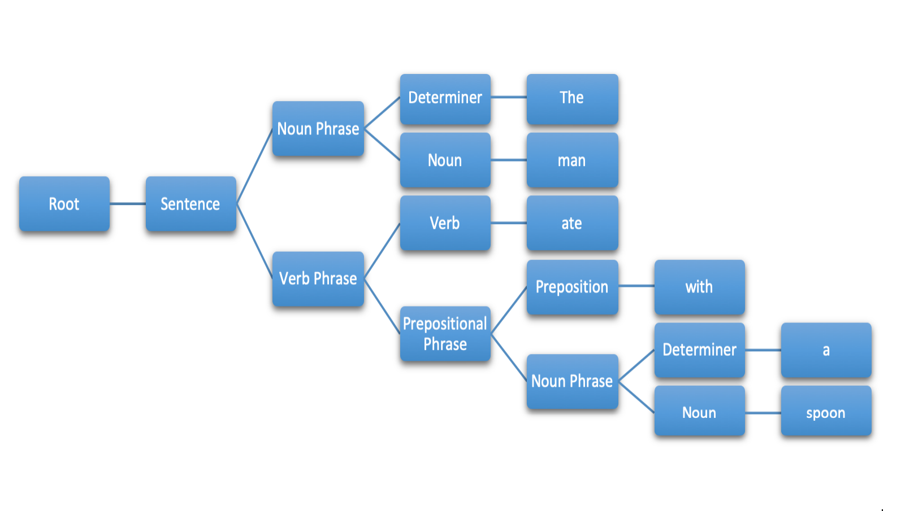
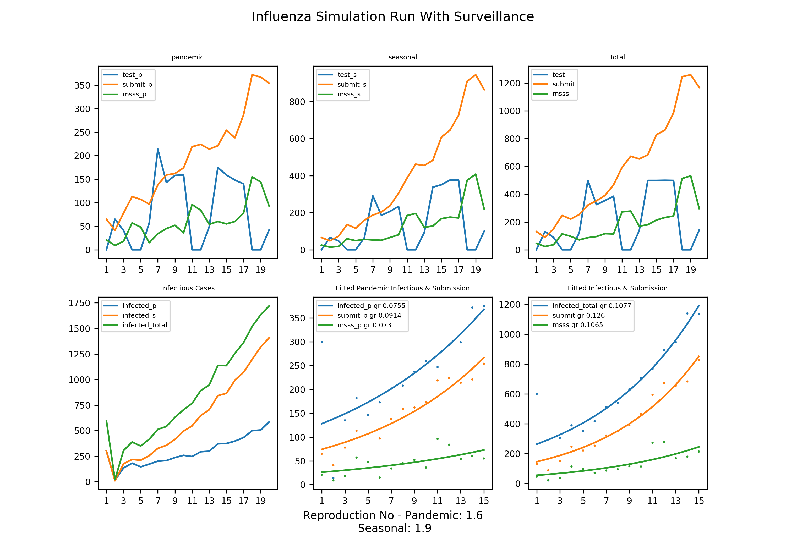

#About Me

<!--Add something else-->
I am a recent graduate in computer science from Johhs Hopkins University.

#Summary

<!-- Concise to not more than 2 lines on A4 paper-->
Computer science student with diverse background and rich experience in industry,
research and academia. A natural language processing and robotic enthusiast,
able to work both independently and in a team, demonstrating motivation and
multi-tasking abilities required to meet demanding deadlines while maintaining
highest standards.

#Education

- M.S.E., Computer Science, Johns Hopkins University, 2018-2020
- M.Tech., Electronics Design and Tech, Indian Institute of Science,2010-2012
- B.E., Electronics and Telecommunication, Rajiv Gandhi Institute, 2006-2010

#Programming Skills
- Python
- C/C++
- Java
- Javascript/Html/Css

#Technical Skills
- React
- Pytorch
- ROS
- Git
- AWS
- OpenMP/MPI/Hadoop

#Courses
- Machine Learning
- Deep Learning
- Natural Language Processing
- Parallel Programming
- Information Retrieval and Web Agents

#Projects

##Decon

[Github Link](https://github.com/amirnafisa/Decon)

August 2019 - May 2020

##Time Travel

[Github Link](https://github.com/amirnafisa/time-travel-for-oose)

August 2019 - Dec 2019

##Legal IR

[Github Link](https://github.com/amirnafisa/InformationRetrieval)

January 2019 - May 2019

##Food NN

[Github Link](https://github.com/amirnafisa/Food101)

<object data="https://github.com/amirnafisa/Food101/blob/master/Report-2.pdf" type="application/pdf" width="700px" height="700px">
    <embed src="https://github.com/amirnafisa/Food101/blob/master/Report-2.pdf">
        
This browser does not support PDFs. Please download the PDF to view it: <a href="https://github.com/amirnafisa/Food101/blob/master/Report-2.pdf">Download PDF</a>.

    </embed>
</object>

August 2018 - December 2018

Food NN is a neural network based project for food image classification. 
It aims to fine tune and ensemble deep neural network architectures in 
resource constrained environment.

##Parser

[Python Implementation](https://github.com/amirnafisa/Parsing)

[C Implementation](https://github.com/amirnafisa/ParserInC)

August 2018 - December 2018

This is a demonstration of the famous Earley's parser. 

Algorithmic complexity of the algorithm is O(R2N3), 
where R is the number of rules and N is the number of words (including 
punctuation literals as unit components). Few pruning strategies are incorporated
to speed up the parser. 

Speed up techniques used are:
- Left corner filtering
- better indexing
- filtering grammar of terminals not needed for the input
- preventing duplicate entries
- keeping only the high probability entries
- pruning rules with lower probabilities

Initial implemenation of parser in python helped in better understanding. C 
implementation was however necessary to improve the speed.

##Influenza Simulation App

[Github Link](https://github.com/amirnafisa/Influenza)

[Report]
January 2019 - May 2019

##E-Surakshak

[IEEE link](https://ieeexplore.ieee.org/document/6526579)

August 2011 - May 2012

